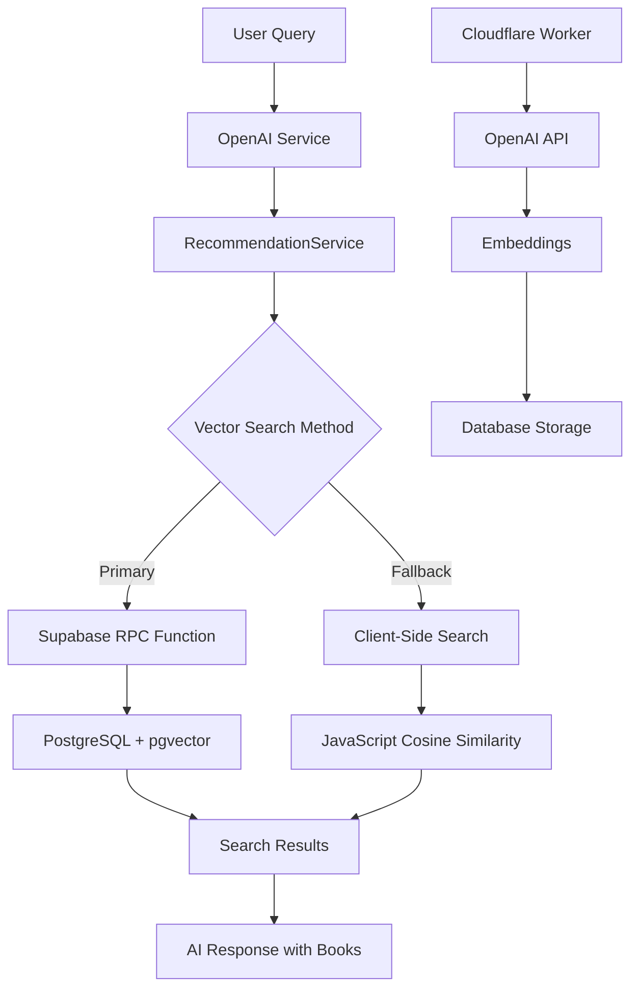

# Vector Search System Documentation

## Overview

The Bookbot Personas application includes a sophisticated vector search system that enables semantic book recommendations using OpenAI embeddings and Supabase with pgvector. This system allows the "Ujo Zajko" persona to provide intelligent book recommendations based on user queries.

## Architecture

### System Components



### Key Technologies

- **OpenAI text-embedding-3-small**: Generates 1536-dimensional embeddings
- **Supabase + pgvector**: Vector database with HNSW indexing
- **PostgreSQL RPC Functions**: Optimized vector similarity search
- **Cloudflare Workers**: OpenAI API proxy for security
- **TypeScript**: Type-safe implementation

## Setup Instructions

### 1. Environment Configuration

Create a `.env` file based on `env-template.txt`:

```bash
# Copy the template
cp env-template.txt .env

# Edit with your actual values
nano .env
```

Required variables:
```env
# Supabase Configuration
SUPABASE_URL=https://your-project-id.supabase.co
SUPABASE_ANON_KEY=eyJhbGciOiJIUzI1NiIsInR5cCI6IkpXVCJ9...
SUPABASE_SERVICE_ROLE_KEY=eyJhbGciOiJIUzI1NiIsInR5cCI6IkpXVCJ9...

# Frontend Variables
VITE_SUPABASE_URL=https://your-project-id.supabase.co
VITE_SUPABASE_ANON_KEY=eyJhbGciOiJIUzI1NiIsInR5cCI6IkpXVCJ9...
VITE_CLOUDFLARE_WORKER_URL=https://your-worker.workers.dev

# OpenAI Configuration
OPENAI_API_KEY=sk-...

# Optional Performance Tuning
EMBEDDING_BATCH_SIZE=50
DEFAULT_SIMILARITY_THRESHOLD=0.7
CACHE_TTL_MS=300000
```

### 2. Database Setup

Run the comprehensive database setup script in your Supabase SQL Editor:

```sql
-- Copy and paste the contents of database-setup.sql
-- This creates all tables, indexes, functions, and policies
```

Or use the Supabase CLI:
```bash
supabase db reset
supabase db push
```

### 3. Import Book Data

If you have a CSV file with book data:

```bash
# Import books from CSV
node src/scripts/import-books.ts "path/to/your/books.csv"
```

### 4. Generate Embeddings

Populate the embeddings table:

```bash
# Generate embeddings for all books
node populate-embeddings.js

# Options:
node populate-embeddings.js --dry-run          # Test without generating
node populate-embeddings.js --batch-size=25    # Smaller batches
node populate-embeddings.js --limit=100        # Process only 100 books
```

### 5. Verify Setup

Run the diagnostic script to check everything is working:

```bash
node scripts/check-database-state.js
```

Run the comprehensive test suite:

```bash
# Full test suite
node scripts/test-vector-search.js

# Quick tests only
node scripts/test-vector-search.js --quick

# With performance benchmarks
node scripts/test-vector-search.js --benchmark

# Custom query
node scripts/test-vector-search.js --query="fantasy adventure"
```

## How It Works

### 1. Embedding Generation

When books are added to the system:

1. **Text Preprocessing**: Book titles are cleaned and normalized
2. **OpenAI API Call**: Text is sent to `text-embedding-3-small` model
3. **Vector Storage**: 1536-dimensional embeddings stored in `book_embeddings` table
4. **Indexing**: HNSW index enables fast similarity search

### 2. Search Process

When a user asks for book recommendations:

1. **Query Processing**: User message is analyzed by OpenAI
2. **Embedding Generation**: Query is converted to embedding vector
3. **Vector Search**: Two-tier approach for reliability:
   - **Primary**: PostgreSQL RPC function with pgvector
   - **Fallback**: Client-side JavaScript calculation
4. **Result Ranking**: Books ranked by cosine similarity
5. **AI Integration**: Results included in system prompt for contextual recommendations

### 3. Performance Optimization

- **HNSW Indexing**: Approximate nearest neighbor search for speed
- **Batch Processing**: Efficient embedding generation
- **Caching**: Results cached for repeated queries
- **Rate Limiting**: Respects OpenAI API limits
- **Fallback Strategy**: Ensures system reliability

## API Reference

### RecommendationService

Main service class for book recommendations:

```typescript
import { RecommendationService } from '@/services/recommendationService';

const service = RecommendationService.getInstance();

// Search for similar books
const results = await service.findSimilarBooksByTitle(
  'Harry Potter',
  {
    limit: 10,
    similarity_threshold: 0.7,
    exclude_ids: [1, 2, 3]
  }
);
```

### EmbeddingService

Handles embedding generation:

```typescript
import { EmbeddingService } from '@/services/embeddingService';

const service = new EmbeddingService(supabase, openaiApiKey);

// Generate embeddings for books
const progress = await service.generateEmbeddingsForBooks(
  books,
  {
    batchSize: 50,
    onProgress: (progress) => console.log(progress)
  }
);
```

### Database Functions

#### search_similar_books

PostgreSQL function for vector similarity search:

```sql
SELECT * FROM search_similar_books(
  '[0.1,0.2,0.3,...]'::text,  -- embedding as text
  0.7,                         -- similarity threshold
  10                           -- max results
);
```

Returns:
- `book_id`: Integer book identifier
- `title`: Book title
- `similarity_score`: Cosine similarity (0-1)
- `master_mother_id`: Parent book ID (for duplicates)
- `great_grandmother_id`: Root book ID
- `misspelled`: Boolean flag
- `deleted_at`: Deletion timestamp (null for active books)

## Configuration

### Vector Search Settings

Configure in `src/config/constants.ts`:

```typescript
export const VECTOR_SEARCH_CONFIG = {
  // Similarity thresholds
  DEFAULT_SIMILARITY_THRESHOLD: 0.7,
  HIGH_SIMILARITY_THRESHOLD: 0.85,
  LOW_SIMILARITY_THRESHOLD: 0.5,
  
  // Performance settings
  DEFAULT_MAX_RESULTS: 10,
  CLIENT_SIDE_SEARCH_LIMIT: 1000,
  VECTOR_SEARCH_TIMEOUT: 10000,
  
  // Batch processing
  EMBEDDING_BATCH_SIZE: 50,
  MAX_CONCURRENT_REQUESTS: 5,
  
  // Caching
  CACHE_TTL_MS: 300000, // 5 minutes
  ENABLE_RESULT_CACHING: true
};
```

### Environment Variables

Performance tuning via environment variables:

```env
# Embedding generation
EMBEDDING_BATCH_SIZE=50
OPENAI_RPM_LIMIT=3000

# Search behavior
DEFAULT_SIMILARITY_THRESHOLD=0.7
CACHE_TTL_MS=300000

# Rate limiting
REQUEST_DELAY_MS=1000
```

## Troubleshooting

### Common Issues

#### 1. Zero Results from Vector Search

**Symptoms**: Search returns no results, falls back to text search

**Causes & Solutions**:
- **No embeddings**: Run `node populate-embeddings.js`
- **Wrong similarity threshold**: Lower the threshold in config
- **Database connection**: Check Supabase credentials
- **RPC function missing**: Run `database-setup.sql`

**Diagnostic**:
```bash
node scripts/check-database-state.js
```

#### 2. Slow Search Performance

**Symptoms**: Search takes >5 seconds, timeouts

**Causes & Solutions**:
- **Missing HNSW index**: Check `database-setup.sql` was run
- **Large dataset**: Increase `CLIENT_SIDE_SEARCH_LIMIT`
- **Network latency**: Use regional Supabase instance
- **Rate limiting**: Increase delays between requests

**Optimization**:
```sql
-- Check if HNSW index exists
SELECT indexname FROM pg_indexes 
WHERE tablename = 'book_embeddings' 
AND indexname LIKE '%hnsw%';

-- Recreate if missing
CREATE INDEX idx_book_embeddings_hnsw ON book_embeddings 
USING hnsw (embedding vector_cosine_ops) 
WITH (m = 16, ef_construction = 64);
```

#### 3. Embedding Generation Failures

**Symptoms**: `populate-embeddings.js` fails with API errors

**Causes & Solutions**:
- **API key invalid**: Check `OPENAI_API_KEY` in `.env`
- **Rate limiting**: Reduce `EMBEDDING_BATCH_SIZE`
- **Network issues**: Add retry logic (already implemented)
- **Cloudflare Worker down**: Check worker URL

**Debug**:
```bash
# Test with dry run
node populate-embeddings.js --dry-run --limit=5

# Verbose logging
node populate-embeddings.js --verbose --limit=10
```

#### 4. RPC Function Errors

**Symptoms**: "RPC function not available" in logs

**Causes & Solutions**:
- **Function not created**: Run `database-setup.sql`
- **Permission issues**: Check RLS policies
- **Wrong function signature**: Verify function parameters

**Fix**:
```sql
-- Check if function exists
SELECT routine_name FROM information_schema.routines 
WHERE routine_schema = 'public' 
AND routine_name = 'search_similar_books';

-- Grant permissions
GRANT EXECUTE ON FUNCTION search_similar_books(text, float, int) TO authenticated;
GRANT EXECUTE ON FUNCTION search_similar_books(text, float, int) TO anon;
```

### Performance Tuning

#### Database Optimization

```sql
-- Analyze table statistics
ANALYZE book_embeddings;

-- Check index usage
SELECT schemaname, tablename, indexname, idx_scan, idx_tup_read, idx_tup_fetch
FROM pg_stat_user_indexes 
WHERE tablename = 'book_embeddings';

-- Tune HNSW parameters for your dataset
DROP INDEX IF EXISTS idx_book_embeddings_hnsw;
CREATE INDEX idx_book_embeddings_hnsw ON book_embeddings 
USING hnsw (embedding vector_cosine_ops) 
WITH (
  m = 16,              -- Higher = better recall, slower build
  ef_construction = 64  -- Higher = better quality, slower build
);
```

#### Application Optimization

```typescript
// Adjust search parameters based on your needs
const searchOptions = {
  similarity_threshold: 0.6,  // Lower = more results
  limit: 20,                  // Higher = more options
  include_deleted: false,     // Exclude deleted books
  exclude_ids: []            // Skip specific books
};

// Enable caching for repeated queries
const VECTOR_SEARCH_CONFIG = {
  ENABLE_RESULT_CACHING: true,
  CACHE_TTL_MS: 600000  // 10 minutes
};
```

### Monitoring

#### Key Metrics to Track

1. **Search Performance**:
   - Average response time
   - Cache hit rate
   - Fallback usage frequency

2. **Embedding Generation**:
   - Success rate
   - API costs
   - Processing time per book

3. **Database Health**:
   - Index usage statistics
   - Query performance
   - Storage usage

#### Logging

Enable detailed logging in development:

```typescript
// In recommendationService.ts
console.log('🔍 Vector search metrics:', {
  method: 'rpc_function',
  duration: Date.now() - startTime,
  results: data?.length || 0,
  threshold: similarityThreshold
});
```

## Cost Estimation

### OpenAI Embedding Costs

- **Model**: text-embedding-3-small
- **Price**: $0.00002 per 1K tokens
- **Average**: ~10 tokens per book title
- **Cost for 10,000 books**: ~$2.00

### Supabase Costs

- **Database storage**: Minimal for embeddings (~6KB per book)
- **API calls**: Included in free tier for moderate usage
- **Compute**: Vector operations are CPU-intensive

### Example Cost Calculation

For a library of 50,000 books:
- **Initial embedding generation**: ~$10
- **Monthly search operations**: ~$1-5 (depending on usage)
- **Supabase Pro plan**: $25/month (recommended for production)

## Best Practices

### Development

1. **Use dry-run mode** for testing embedding generation
2. **Start with small datasets** to validate the pipeline
3. **Monitor API usage** to avoid unexpected costs
4. **Test both search methods** (RPC and client-side)
5. **Validate embedding dimensions** before storage

### Production

1. **Enable result caching** to reduce API calls
2. **Monitor search performance** and optimize thresholds
3. **Set up proper error handling** and fallbacks
4. **Use connection pooling** for database efficiency
5. **Implement rate limiting** to protect against abuse

### Security

1. **Use service role key** only in server environments
2. **Implement RLS policies** for multi-tenant applications
3. **Validate user inputs** before embedding generation
4. **Monitor API key usage** for suspicious activity
5. **Use Cloudflare Workers** to proxy OpenAI requests

## Advanced Topics

### Custom Similarity Functions

You can create custom similarity functions for specific use cases:

```sql
-- Weighted similarity function
CREATE OR REPLACE FUNCTION weighted_book_similarity(
  query_embedding vector(1536),
  title_weight float DEFAULT 0.7,
  content_weight float DEFAULT 0.3
) RETURNS TABLE (
  book_id int,
  title text,
  weighted_score float
) AS $$
BEGIN
  -- Custom implementation here
END;
$$ LANGUAGE plpgsql;
```

### Hybrid Search

Combine vector search with traditional text search:

```typescript
async function hybridSearch(query: string, options: SearchOptions) {
  // Get vector results
  const vectorResults = await this.performVectorSearch(embedding, limit);
  
  // Get text results
  const textResults = await this.performTextSearch(query, limit);
  
  // Combine and re-rank
  return this.combineResults(vectorResults, textResults, options);
}
```

### Multi-language Support

For international book collections:

```sql
-- Language-specific embeddings
ALTER TABLE book_embeddings ADD COLUMN language text DEFAULT 'en';

-- Language-aware search function
CREATE OR REPLACE FUNCTION search_books_by_language(
  query_embedding vector(1536),
  target_language text DEFAULT 'en',
  similarity_threshold float DEFAULT 0.7
) RETURNS TABLE (...) AS $$
-- Implementation
$$ LANGUAGE plpgsql;
```

## Support

### Getting Help

1. **Check the troubleshooting section** above
2. **Run diagnostic scripts** to identify issues
3. **Review logs** for specific error messages
4. **Test with minimal examples** to isolate problems

### Useful Commands

```bash
# Quick health check
node scripts/check-database-state.js

# Test specific functionality
node scripts/test-vector-search.js --quick

# Generate sample embeddings
node populate-embeddings.js --limit=10 --dry-run

# Check database indexes
psql -h your-host -d your-db -c "\\di+ book_embeddings*"
```

### Resources

- [OpenAI Embeddings Guide](https://platform.openai.com/docs/guides/embeddings)
- [pgvector Documentation](https://github.com/pgvector/pgvector)
- [Supabase Vector Guide](https://supabase.com/docs/guides/ai/vector-embeddings)
- [HNSW Algorithm Paper](https://arxiv.org/abs/1603.09320)

---

*This documentation covers the complete vector search system. For questions or improvements, please refer to the troubleshooting section or create an issue in the repository.*
